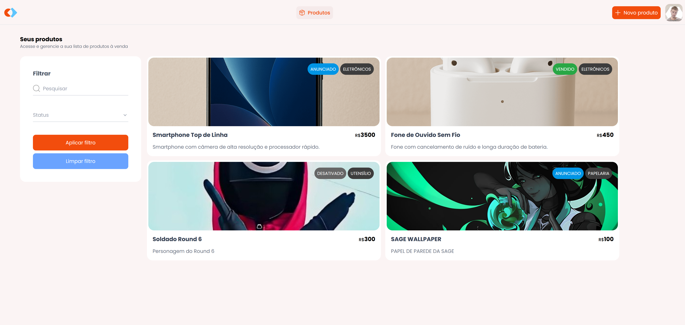

## MarketPlace
Projeto de Cadastro de Produtos feito durante o Desafio Angular na Prática da Rocketseat

<h1 align="center">
  
</h1>

<br /><br />

## 🚀 Tecnologias
- [TypeScript](https://www.typescriptlang.org/) > Linguagem Principal da Aplicação
- [Angular](https://angular.dev/) > Framework Frontend da Aplicação 
- [TailwindCSS](https://tailwindcss.com/) > Extensão para o NextJS para estilização das páginas
- [RxJS](https://rxjs.dev/) > Biblioteca para Manipulação de Dados
- [Express](https://expressjs.com/) > Framework Backend da Aplicação


<br /><br />

## 💻 Executando o Projeto - Frontend


#### 1º Passo - Configure as Ferramentas necessárias para rodar o projeto:

- [Node.js](https://nodejs.org/en/) (Versão 22)


#### 2º Passo - Dentro da pasta "frontend-gestao-marketplace", instale as Dependências:

```bash
# Dependencias
$ npm install

# Angular
$ npm i -g @angular/cli@20
```

#### 3º Passo - Rode o projeto:

```bash
$ npm run start
```

<br /><br />

## 💻 Executando o Projeto - Backend


#### 1º Passo - Configure as Ferramentas necessárias para rodar o projeto:

- [Node.js](https://nodejs.org/en/) (Versão 22)


#### 2º Passo - Dentro da pasta "backend-gestao-marketplace", instale as Dependências:

```bash
$ npm install
```

#### 3º Passo - Rode o projeto:

```bash
$ npm run dev
```

<br /><br />

## Link do Deploy